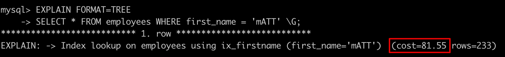
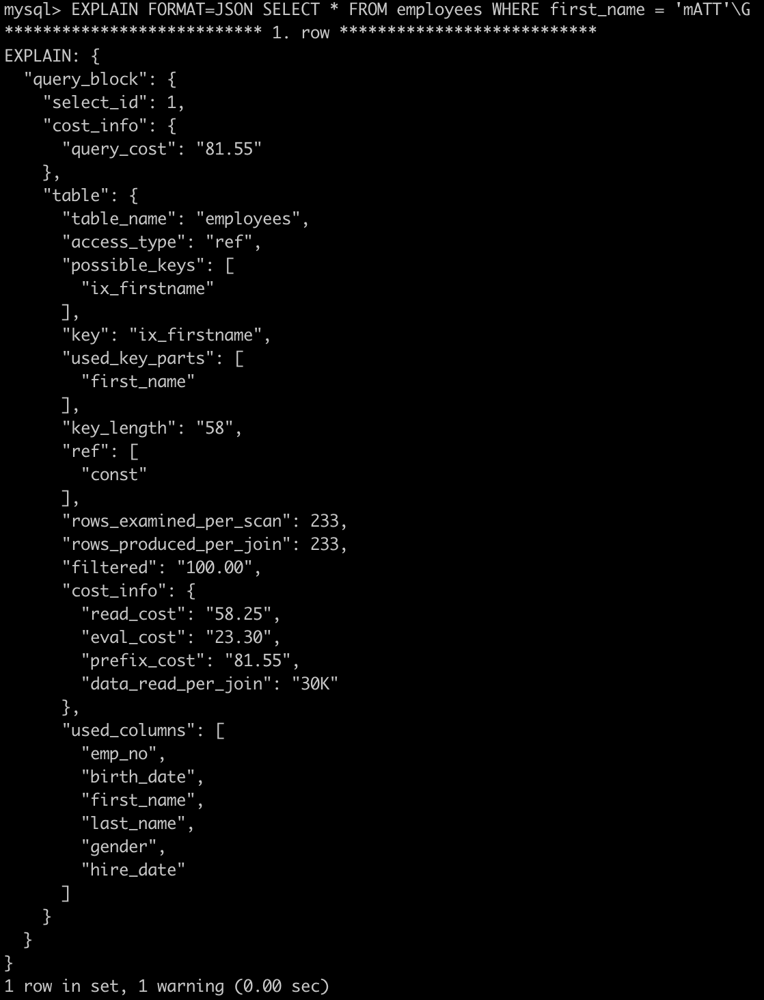
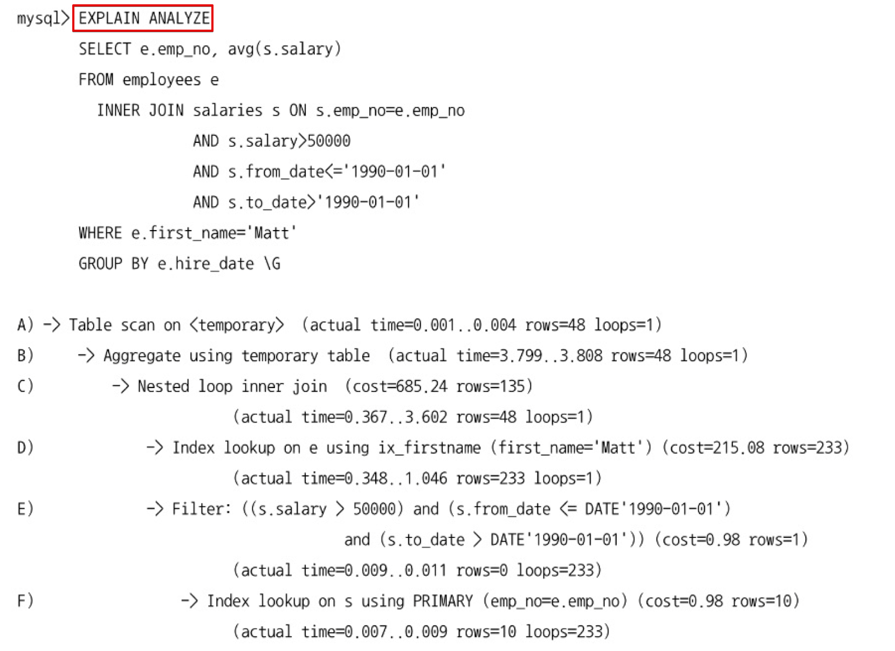
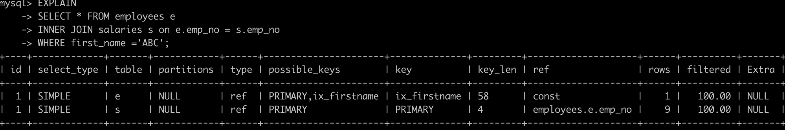

# 스터디

### 10.1.2.3 히스토그램과 인덱스

```sql
SELECT * FROM employees
WHERE first_name = 'Tonny'
AND birth_date BETWEEN '1954-01-01' AND '1955-01-01';

// indexed column: first_name
```

위 쿼리에서 인덱스된 컬럼을 검색 조건으로 사용한 경우

- 해당 컬럼의 히스토그램을 사용하지 않고 실제 인덱스 다이브를 통해 직접 수집한 정보를 활용함
    - 인덱스 다이브: 조건절에 일치하는 레코드 건수를 예측하기 위해 실제 인덱스의 B-Tree를 샘플링하는 작업
- 실제 검색 조건 대상 값에 대한 샘플링을 실행하는 것이므로 항상 히스토그램보다 정확한 결과를 기대할 수 있음
- 따라서 히스토그램은 주로 인덱스되지 않은 컬럼에 대한 데이터 분포도를 참조하는 용도로 사용됨

## 10.1.3 코스트 모델(Cost Model)

전체 쿼리의 비용을 계산하는 데 필요한 단위 작업들의 비용을 코스트 모델이라고 한다.

MySQL 8.0 가준 코스트 모델은 다음 2개 테이블에 저장된 설정값을 사용한다.

- server_cost: 인덱스를 찾고 레코드를 비교하고 임시 테이블 처리에 대한 비용 관리
- engine_cost: 레코드를 가진 데이터 페이지를 가져오는 데 필요한 비용 관리

다음은 실행 계획의 계산된 코스트를 확인하는 예시이다.





코스트 모델에서 중요한 것은 각 단위 작업에 설정되는 비용 값이 커지면 어떤 실행계획들이 고비용으로 바뀌고 어떤 실행계획들이 저비용으로 바뀌는지 파악하는 것이다. 대표적으로 각 단위 작업의 비용으 변경되면 예상할 수 있는 결과들은 다음과 같다.

- key_compare_cost 비용을 높이면
    - 가능한 정렬을 수행하지 않는 방향을 선택할 가능성이 높아짐
- row_evulate_cost 비용을 높이면
    - 풀스캔 실행 쿼리들의 비용이 높아지고, 가능한 인덱스 레인지 스캔을 선택할 가능성이 높아짐
- disk_template_create_cost와 disk_tempate_row_cost 비용을 높이면
    - 디스크에 임시 테이블을 만들지 않는 방향을 선택할 가능성이 높아짐
- memory_template_create_cost와 memory_template_row_cost 비용을 높이면
    - 메모리 임시 테이블을 만들지 않는 방향을 선택할 가능성이 높아짐
- io_block_read_cost 비용이 높아지면
    - 가능한 InnoDB 버퍼 풀에 데이터 페이지가 많이 적재된 인덱스를 사용할 가능성이 높아짐
- memory_block_read_cost 비용이 높아지면
    - InnoDB 버퍼 풀에 적재된 데이터 페이지가 상대적으로 적어도 그 인덱스를 사용할 가능성 높아짐

<aside>
💡 각 단위 작업의 비용을 사용자가 변경할 수 있는 기능을 제공한다고 꼭 바꿔야 하는 것은 아님.
코스트 모델은 MySQL 하드웨어와 내부적인 처리 방식에 대한 깊이있는 지식을 필요로 하기에 전문적인 지식이 없는 상태에서는 함부로 변경하지 않는게 좋음.
기본값으로도 수많은 응용프로그램에서 잘 사용 중임

</aside>

## 10.2 실행 계획 확인

쿼리 앞에 EXPLAIN 명령어를 붙이면 해당 쿼리에 대한 실행 계획 확인이 가능하다.

## 10.2.1 실행 계획 출력 포맷

MySQL 8.0 부터 FORMAT 옵션을 사용해 실행 계획의 표시 방법을 TABLE, JSON, TREE 형태로 볼 수 있다.

```sql
mysql> EXPLAIN FORMAT=TABLE SELECT * FROM employees e INNER JOIN salaries s ON s.emp_no=e.emp_no WHERE first_name = 'ABC';
+----+-------------+-------+------------+------+----------------------+--------------+---------+--------------------+------+----------+-------+
| id | select_type | table | partitions | type | possible_keys        | key          | key_len | ref                | rows | filtered | Extra |
+----+-------------+-------+------------+------+----------------------+--------------+---------+--------------------+------+----------+-------+
|  1 | SIMPLE      | e     | NULL       | ref  | PRIMARY,ix_firstname | ix_firstname | 58      | const              |    1 |   100.00 | NULL  |
|  1 | SIMPLE      | s     | NULL       | ref  | PRIMARY              | PRIMARY      | 4       | employees.e.emp_no |    9 |   100.00 | NULL  |
+----+-------------+-------+------------+------+----------------------+--------------+---------+--------------------+------+----------+-------+

EXPLAIN FORMAT=JSON  SELECT * FROM employees e INNER JOIN salaries s ON s.emp_no=e.emp_no WHERE first_name = 'ABC';
+--------------------------------------------------------------------------------------------------------------------------------------------------------------------------------------------------------------------------------------------------------------------------------------------------------------------------------------------------------------------------------------------------------------------------------------------------------------------------------------------------------------------------------------------------------------------------------------------------------------------------------------------------------------------------------------------------------------------------------------------------------------------------------------------------------------------------------------------------------------------------------------------------------------------------------------------------------------------------------------------------------------------------------------------------------------------------------------------------------------------------------------------------------------------------------------------------------------------------------------------------------------------------------------------------------------------------------------------------------------------------------------------------------------------------------------------------------------------------------------------------------------------------------------------------------------------------------------------------------------------------------------------------------------------------------------------------------------------------------------------------------------------------------------------------------------------------------+
| EXPLAIN                                                                                                                                                                                                                                                                                                                                                                                                                                                                                                                                                                                                                                                                                                                                                                                                                                                                                                                                                                                                                                                          |
+--------------------------------------------------------------------------------------------------------------------------------------------------------------------------------------------------------------------------------------------------------------------------------------------------------------------------------------------------------------------------------------------------------------------------------------------------------------------------------------------------------------------------------------------------------------------------------------------------------------------------------------------------------------------------------------------------------------------------------------------------------------------------------------------------------------------------------------------------------------------------------------------------------------------------------------------------------------------------------------------------------------------------------------------------------------------------------------------------------------------------------------------------------------------------------------------------------------------------------------------------------------------------------------------------------------------------------------------------------------------------------------------------------------------------------------------------------------------------------------------------------------------------------------------------------------------------------------------------------------------------------------------------------------------------------------------------------------------------------------------------------------------------------------------------------------------------------+
| {
  "query_block": {
    "select_id": 1,
    "cost_info": {
      "query_cost": "2.10"
    },
    "nested_loop": [
      {
        "table": {
          "table_name": "e",
          "access_type": "ref",
          "possible_keys": [
            "PRIMARY",
            "ix_firstname"
          ],
          "key": "ix_firstname",
          "used_key_parts": [
            "first_name"
          ],
          "key_length": "58",
          "ref": [
            "const"
          ],
          "rows_examined_per_scan": 1,
          "rows_produced_per_join": 1,
          "filtered": "100.00",
          "cost_info": {
            "read_cost": "0.25",
            "eval_cost": "0.10",
            "prefix_cost": "0.35",
            "data_read_per_join": "136"
          },
          "used_columns": [
            "emp_no",
            "birth_date",
            "first_name",
            "last_name",
            "gender",
            "hire_date"
          ]
        }
      },
      {
        "table": {
          "table_name": "s",
          "access_type": "ref",
          "possible_keys": [
            "PRIMARY"
          ],
          "key": "PRIMARY",
          "used_key_parts": [
            "emp_no"
          ],
          "key_length": "4",
          "ref": [
            "employees.e.emp_no"
          ],
          "rows_examined_per_scan": 9,
          "rows_produced_per_join": 9,
          "filtered": "100.00",
          "cost_info": {
            "read_cost": "0.81",
            "eval_cost": "0.95",
            "prefix_cost": "2.10",
            "data_read_per_join": "151"
          },
          "used_columns": [
            "emp_no",
            "salary",
            "from_date",
            "to_date"
          ]
        }
      }
    ]
  }
} |

mysql> EXPLAIN FORMAT=TREE  SELECT * FROM employees e INNER JOIN salaries s ON s.emp_no=e.emp_no WHERE first_name = 'ABC';
+----------------------------------------------------------------------------------------------------------------------------------------------------------------------------------------------------------------+
| EXPLAIN                                                                                                                                                                                                        |
+----------------------------------------------------------------------------------------------------------------------------------------------------------------------------------------------------------------+
| -> Nested loop inner join  (cost=2.10 rows=9)
    -> Index lookup on e using ix_firstname (first_name='ABC')  (cost=0.35 rows=1)
    -> Index lookup on s using PRIMARY (emp_no=e.emp_no)  (cost=1.75 rows=9)
 |
+----------------------------------------------------------------------------------------------------------------------------------------------------------------------------------------------------------------+
1 row in set (0.01 sec)
```

## 10.2.2 쿼리의 실행 시간 확인

MySQL 8.0부터 EXPLAIN ANALYZE를 통해 쿼리의 실행 계획과 단계별 소요 시간 정보를 확인할 수 있다.

해당 명령어는 결과를 항상 TREE 포맷으로 보여주므로 FORMAT 명령어는 사용할 수 없다.



TREE 포맷의 해당 실행 계획에서 들여쓰기는 호출 순서를 의미하며, 실제 실행 순서는 다음과 같다.

- 들여쓰기가 같은 레벨: 상단에 위치한 라인이 먼저 실행
- 들여쓰기가 다른 레벨: 가장 안쪽에 위치한 라인이 먼저 실행

EXPLAIN 명령어와 달리 EXPLAIN ANALYZE는 실제 쿼리를 실행한 뒤 실행 계획과 소요된 시간을 보여주므로 쿼리의 실행 시간이 길다면 EXPLAIN으로 우선 튜닝을 진행하고 EXPLAIN ANALYZE를 실행하는 것이 좋다.

## 10.3 실행 계획 분석

실행 계획에서 실행 순서는 위에서 아래 순서대로 표시된다.

출력된 실행 계획에서 위쪽일수록(id 값이 작을수록) 쿼리 바깥 부분이거나 먼저 접근한 테이블이고, 아래쪽 결과일수록(id 값이 클수록) 쿼리 안쪽 또는 나중에 접근한 테이블에 해당된다.



실행 계획의 id 컬럼은 테이블의 접근 순서를 의미하는 것이 아닌, 쿼리 실행 단계의 순서를 표시하며, 각 단계의 고유한 ID 값이다.